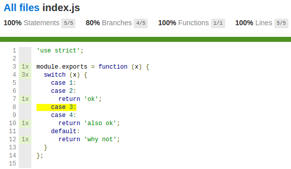

# incorrect-coverage

Demo repo to demonstrate problems in code coverage reports with switch cases.



In the [test file](./test.js), we run tests that test the switch case for `case 1`, `case 4` and the default case.
`case 2` and `case 3` are not tested. However, the code coverage, as shown above, shows that we've handled all branches except `case 3`, thus including `case 2` which is not actually covered.

The reason, I suspect, is because the program is transformed to be something like:

```js
module.exports = function (x) {
	switch (x) {
		case 1:
		  incrementBranch_1();
		case 2:
			incrementBranch_2();
			incrementStatement_1();
			return 'ok';
		case 3:
			incrementBranch_3();
		case 4:
			incrementBranch_4();
			incrementStatement_2();
			return 'also ok';
		default:
			incrementBranch_default();
			incrementStatement_3();
			return 'why not';
	}
};
```

but because of the fallthrough behaviour, `incrementBranch_2()` also gets called when `case 1` is entered.

This falsifies the code coverage, and makes you think you have 100% code coverage when you actually don't. [In one of my packages](https://github.com/jfmengels/eslint-ast-utils/blob/master/lib/contains-identifier.js), I duplicated some switch-case heavy code in order to have a reliable code coverage.
